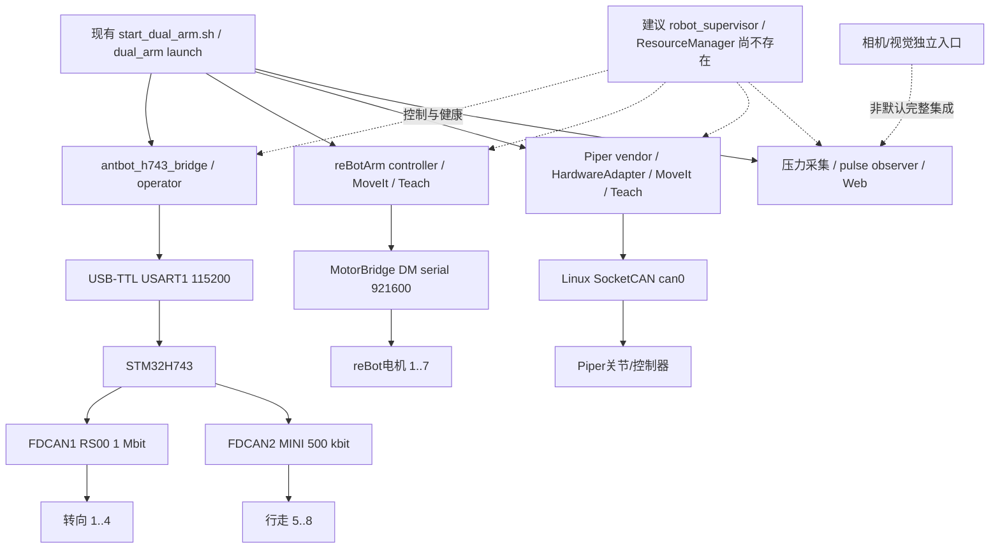
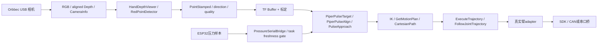
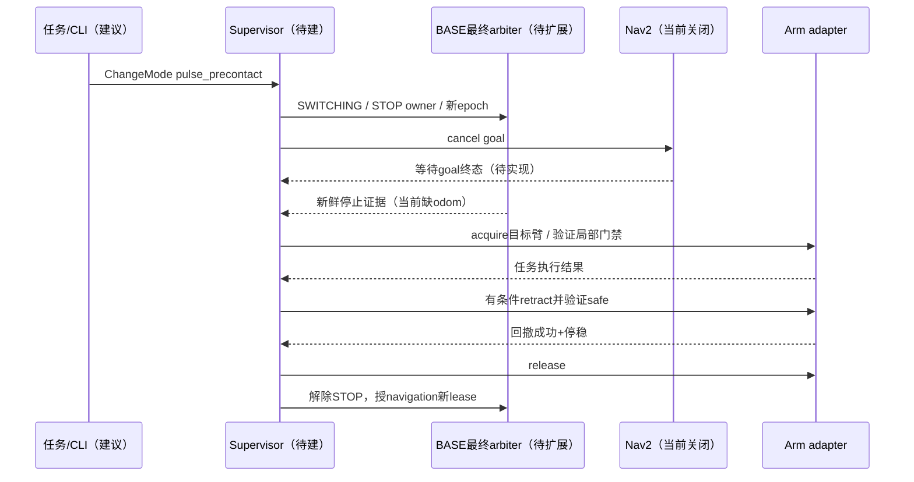
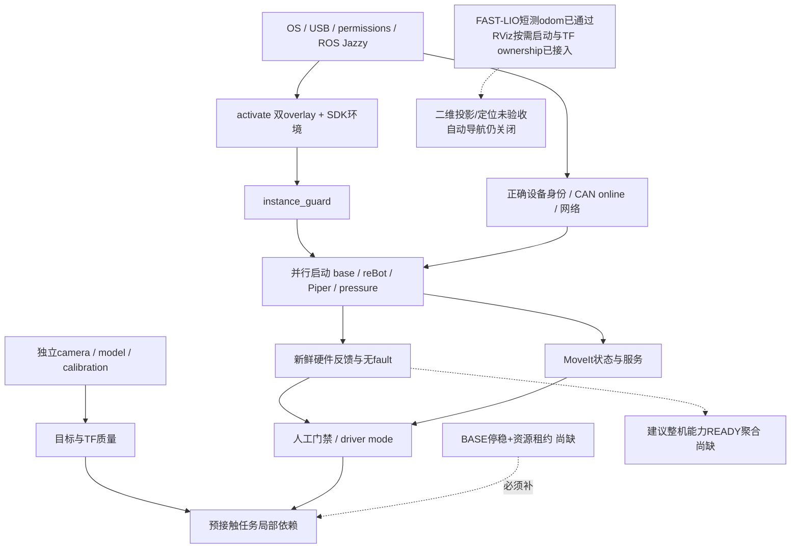
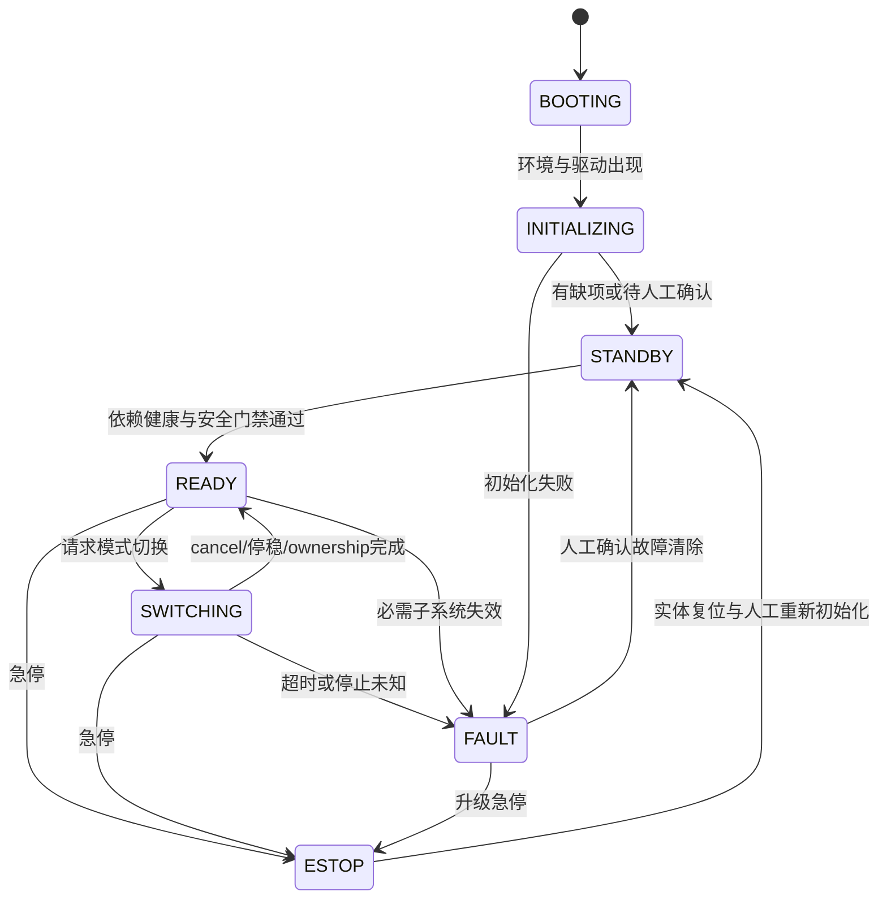

# AntBot 系统架构梳理 / 控制链路审计

审计日期：2026-09-15。静态源码审计；CONFIRMED 指实现/配置已发现，不代表真机在线。UNKNOWN / NEED_CONFIRMATION 不作为可执行配置。详见 [扫描范围](SOURCE_SCAN.md)。

**一句话：当前工程是已有总launch和局部安全门禁的“reBotArm+Piper-H双臂工作台、H743舵轮底盘、把脉采集/网页”组合，尚缺强制统一控制权、整机健康READY与真实导航停稳闭环。**

本轮只新增文档；没有运行ROS节点、设备访问、CAN初始化、自动enable、运动或协议修改。分析对象是当前工作树，包含已有未提交修改；不是重新设计虚构机器人。设计图明确标注现状与建议，UNKNOWN不当成已具备能力。

# 1. System Overview

当前入口`bash start_dual_arm.sh`已一次拉起双臂、底盘operator、压力/web（无串口冲突时）；它不是所要求的“硬件初始化→整机READY→统一Supervisor任务切换”。ROS Jazzy来自activate；Jetson Nano/NX、Ubuntu/JetPack实机版本尚待核实。默认两臂型号是reBot DM+Piper-H，物理左右映射只对Piper右侧mount有源码注释，不能默认两台Piper。

[扫描范围/包/入口](SOURCE_SCAN.md) · [硬件](HARDWARE_INVENTORY.md) · [完整接口](ROS_INTERFACE_MATRIX.md) · [控制链](CONTROL_CHAINS.md) · [控制权](CONTROL_OWNERSHIP.md) · [启动](STARTUP_SEQUENCE.md) · [状态机](STATE_MACHINES.md) · [故障安全](FAULT_AND_SAFETY.md) · [问题清单](ARCHITECTURE_ISSUES.md) · [Supervisor建议](SUPERVISOR_DESIGN.md) · [模式切换](MODE_TRANSITIONS.md) · [命名迁移](ROS_NAMING_MIGRATION.md) · [迁移路线](MIGRATION_PLAN.md) · [机器可读接口](interfaces.yaml)。

# 2. Hardware Architecture

主机经UART控制H743；H743 FDCAN1控制RS00转向1..4（1M），FDCAN2控制MINI行走5..8（500k）。Piper Linux can0独立于MCU CAN。reBot DM经MotorBridge串口921600（桥后CAN细节未知）；RS型号另走Linux CAN。相机、雷达、IMU和压力采集按硬件清单区分已发现配置与实际装配。实体急停独立切动力要求有文档，实际实施未确认。



# 3. Software Architecture

root src与dual_arm_ws/src独立overlay；root build packages-up-to antbot_real_bringup，dual overlay后source。rebotarm_pulse存在双副本；硬件MotorBridge依赖.hardware-venv/共享库，视觉有独立.venv。固件App是本仓库可追踪实现，供应商piper_sdk/MotorBridge协议内部没有同等源码深度，边界标UNKNOWN。旧ROS1/仿真/演示源码不代表当前launch使用。

# 4. ROS Graph

完整pub/sub/service/action/parameters/timer与launch remap见接口矩阵；下图为关键控制入口静态图，不宣称实机runtime graph。

```mermaid
flowchart LR
    Joy[/joy] --> XB[base MappingXbox]
    Joy --> XA[arm XboxTwist]
    KB[RViz keyboard] --> MUX[operator_manager Xbox/keyboard mux]
    XB --> MUX
    MUX --> CV[/cmd_vel Twist]
    CV --> HB[H743 bridge]
    XA --> Servo[MoveIt Servo]
    Servo --> ST[JointTrajectory stream]
    ST --> Adapters[reBot controller / Piper adapter]
    Plan[MoveIt / Teach / Pulse task] --> FJT[FollowJointTrajectory Action]
    FJT --> Adapters
    Adapters --> State[独立 joint_states / ArmStatus]
    HB --> BS[/rs00/motor_status + /joint_states]
    AM[active_arm_manager] --> Selected[/dual_arm/selected]
    Selected --> XA
    AM -. 异步CancelGoal无终态屏障 .-> Plan
    Nav[Nav2 默认关闭] -. 缺odom .-> CV
```

# 5. Control Chains

9条链路分组见CONTROL_CHAINS，包括UART/MCU/CAN追到电机、双臂Action/Servo/低层/Leader路径、视觉TF规划、压力安全网页与LiDAR/IMU候选。每组给出文件、函数、接口、设备及未知下层。



该图为源码可接链，camera/detection并不默认随总入口启动；未确认手眼文件、frame、任务执行策略时不能视作自动闭环。

# 6. Device Interfaces

稳定H743/pressure by-id默认已有；reBot default ACM2有冲突风险且SDK只识别/dev/tty前缀，by-id需先解决transport选择。Linux can0实际bitrate、适配器USB身份及OS准备未知。机器可读interfaces.yaml只记录当前源码事实，deployable=false；left_arm实施映射保持UNKNOWN，避免配置误操作。

# 7. Control Ownership

已有base遥控mux、两臂Xbox handoff、driver state gate、pressure lease、整机instance guard；均不能替代跨任务资源ownership。最危险的当前可达冲突是Piper轨迹Action与Servo交错写driver_joint_command，vendor命令/enable还可绕过adapter。旧双Piper启动的同can0+autoenable属于额外误用风险。

以下是建议切换事务，现有active_arm_manager只实现其中局部Xbox锁与异步cancel：



# 8. Startup Sequence

并行launch不是硬件依赖屏障。guard输出触发stack只验证单实例锁。CAN online→vendor/反馈→人工enable→arm任务；UART/ACK→底盘人工门禁；camera/TF/pressure fresh→pulse；odom/scan/map/arms safe→navigation。压力可被跳过、vendor/adapter和RViz可respawn，Supervisor必须识别部分能力降级。



# 9. State Machines

底盘MCU有细粒度startup/ARMED/READY/FAULT与translation timeout；reBot有TRAJ/LOWLEVEL/GRAVITY/SAFE_HOMING；Piper有action/gravity flags；Piper预接触有明确PlanningState。没有整机统一状态机，不能声称如下建议图已实现：



mode与active_task分开；NAVIGATION与完整PULSE能力当前均不能自动开放。

# 10. Fault Handling

本地有MCU命令300ms超时、反馈watchdog、CAN bus-off latch、bridge freshness和断线门禁、reBot Servo0.15s hold、Piper tracking/feedback/Leader恢复、pulse target/pressure质量检查。没有整机统一故障传播与ESTOP反馈/复位链。UI关闭/reBot shutdown会尝试safe_home，禁止把退出当急停。pressure串口open/web在线或离线安全零joint_states不代表硬件READY。

# 11. Current Problems

最大的5个问题：①最终writer未强制统一ownership，尤其Piper Action/Servo/旁路；②启动自动enable与退出safe_home和全局安全意图不统一；③没有cancel终态、停稳与BASE/双臂事务互锁；④没有能力READY/heartbeat/故障传播；⑤FAST-LIO已接入一键程序的RViz按需启动并收敛`odom -> base_link` ownership，但最新短测双雷达无数据，设备物理身份、IMU yaw符号、二维Nav2投影与定位合同仍未验收，不能形成导航任务闭环。

具体分级：P0 3项、P1 6项，全部带证据和触发条件，见ARCHITECTURE_ISSUES。等级并非宣称实机事故。最该先改：**Piper最终adapter的Action/Servo互斥并收敛vendor旁路**；reBot自动使能/退出回家同时作为独立安全复核。

# 12. Recommended Architecture

最小Supervisor+ResourceManager+health adapters；base沿用mux扩展最终门禁，arms保留当前轨迹/SDK adapter加owner/epoch/本地watchdog。Service租约、Action模式/任务、Lifecycle初始化协作；不为ros2_control switching重写所有硬件。普通停机与ESTOP分支分离，切换失败不自动回撤/恢复导航。

一次启动还缺：幂等设备准备、正确transport/USB拓扑、受控初始化与健康屏障、能力READY、依赖激活与降级、有序安全退出。顺畅ownership切换还缺：所有writer强制owner校验、取消终态、真实停稳、安全姿态/撤回验证、任务故障补偿和传感器freshness。统一bringup包装现有launch，不机械拆十个文件。

# 13. Migration Plan

Phase0文档→Phase1安全/最终命令入口→Phase2身份/健康→Phase3强制ownership→Phase4Supervisor/模式屏障→Phase5统一bringup→Phase6真实odom/导航与预接触task→Phase7故障恢复/命名收敛。每期文件、风险、功能影响和验收见MIGRATION_PLAN，不建议全部重写。

## 静态统计与限制

硬件表17条（CONFIRMED源码11、LIKELY 4、UNKNOWN 2；含数量型组件与候选，不是实机数量）。ROS manifests 47、不同包名45；Python直接Node类73、C++ Node类19；launch Node声明262。Topic表达式216、Service表达式110、Action表达式12（AST唯一表达式，不是resolved graph数量；循环可展开多个接口）。动态接口调用点256需结合namespace/参数/table解析，source_inventory提供全量证据。

未调用ros2 node/topic list或设备检查；运行时节点/话题/服务/Action数量、实际CAN/USB拓扑、标定/控制器固件版本均UNKNOWN / NEED_CONFIRMATION。供应商库内部和部分C++动态接口仍需后续语义/运行只读核对，矩阵保留调用上下文，不伪造完整resolved graph。

补充：本机安装SDK已只读追到Piper编码与CAN发送、MotorBridge native传输选择；详见[SDK及安装证据](SDK_AND_INSTALL_EVIDENCE.md)。供应商内部UNKNOWN仅指Piper控制器电机路由及MotorBridge native/桥固件后的协议，不再指Python SDK发送实现。
